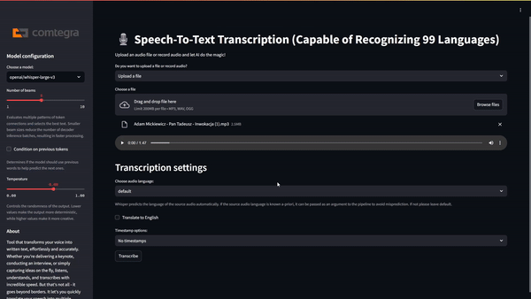

<a href="https://github.com/Comtegra/speech-to-text">
  
  <h1 align="center">Speech-To-Text</h1>
</a>

A simple open source Speech-To-Text app. Powered by Comtegra GPU Cloud and Whisper.
 

<b>whisper-large-v3:</b> 5 minutes of audio → 35 seconds of processing 
<b>whisper-large-v3-turbo:</b> 5 minutes of audio → 8 seconds of processing

Made with ❤️ by <a href="https://cgc.comtegra.cloud/">Comtegra S.A.</a>

# Tech stack

- [Streamlit](https://streamlit.io/) - for the app frontend
- [Python](https://www.python.org/) - for the app backend
- [Comtegra GPU Cloud (CGC)](https://cgc.comtegra.cloud/) - for the best cloud compute
- [Whisper-large-v3](https://huggingface.co/openai/whisper-large-v3), [Whisper-large-v3-turbo](https://huggingface.co/openai/whisper-large-v3-turbo) - for the speech to text models

# Demo

# Possible future improvements

- [x] Improve how timestamps work
- [ ] Integrate additional/newer STT models
- [ ] Implement real-time transcription
- [x] Option to transcribe only a part of the audio
- [x] Add voice recording option

The sky's the limit! With [CGC (Comtegra GPU Cloud)](https://cgc.comtegra.cloud/), we're only limited by our imagination.

## Support

- Visit our [usecase](./usecase.md) to see how to run the app and how it works
- Visit our [documentation](https://docs.cgc.comtegra.cloud/) for more detailed information
- For questions or support, please contact: ai@comtegra.pl

## License

This project is licensed under the Apache License 2.0. See the [LICENSE](LICENSE.md) file for details.

## About [Comtegra S.A.](https://comtegra.pl/)
Comtegra is an IT systems integrator based in Poland, specializing in various aspects of information technology, including data storage and management, information security, and network construction. Founded in 1999, Comtegra has established itself as a significant player in the Polish IT market, providing services such as backup solutions, cybersecurity, and virtualization technologies. The company emphasizes the integration of artificial intelligence within business operations to enhance data management and decision-making processes.