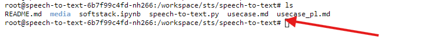
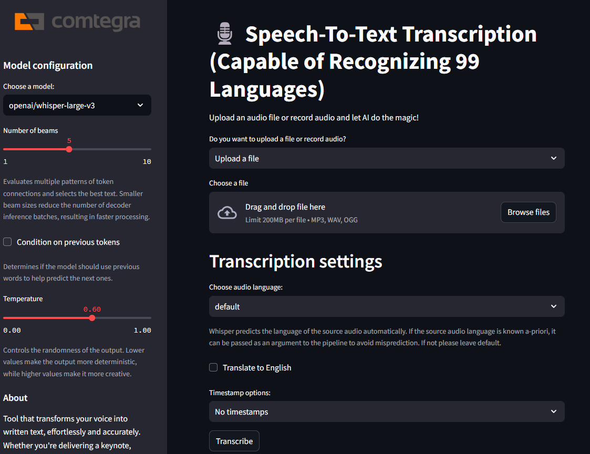
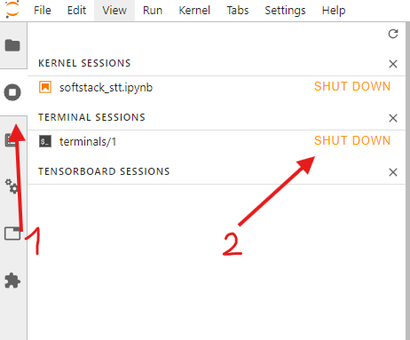

# Speech-To-Text

Speech-To-Text is a tool that helps you transform your voice into written text with the help of AI.

## How to run it

### Setup CGC Environment

This application can be deployed and run on Comtegra GPU Cloud (CGC) for improved accessibility and scalability. CGC provides a robust and secure environment optimized for AI-powered applications like this one.

After installing and setting up [cgcsdk](https://docs.cgc.comtegra.cloud/Getting%20Started/installation) on your computer, open the terminal on your computer and do the following steps (feel free to change parameters as needed, the ones shown are the defaults):

### Create volume
```bash
cgc volume create <your_volume_name> --size <your_volume_size>
```

For example, to create a volume named "sts" with a size of 15GB, you would run:
```bash
cgc volume create sts --size 15
```

### Create a compute
For this project, we set up a PyTorch environment using an A5000 for optimal performance and a 15GB mounted volume.
```bash
cgc compute create --name <compute-name> -c <your_cpu_count> -m <your_memory_size> -g <your_gpu_count> -gt <your_gpu_type> -v <your_volume_name> <your_base_image>
```
For example, to create a compute named "speech-to-text" and mount it with the volume "sts" we created earlier, you would run:
```bash
cgc compute create --name speech-to-text -c 4 -m 8 -g 1 -gt A5000 -v sts nvidia-pytorch
```
 

### Open port in CGC
After creating the compute, you need to open port eg. 9001 to access the Streamlit app later on.
```bash
cgc compute port add -n <port-name> -p <port-number> <compute-name>
```

> **Note**: Feel free to change the port name and number to whatever you want!

For example, to open port 9001, called "frontend" for a compute named "speech-to-text", you would run:

```bash
cgc compute port add -n frontend -p 9001 speech-to-text
```
After being prompted about whether you want to expose the port to the internet and continue, type "Y" and press enter.

## Accessing CGC
After creating the compute, you can access the CGC environment by using the following command in the terminal:
```bash
cgc compute list -d
```
Copy the link to your compute with `\?token` and paste it in your browser. You can also access the CGC compute login page by just copying the link and then logging in by providing your token.

### Clone the repository
After logging in open the terminal in the compute and clone the repository. If you don't see the launcher tab press the plus sign in the top left corner and search for the terminal. Then type the commands below to clone the repository in the directory you want to keep it in. We're gonna use the volume we created earlier:

```bash
cd sts
git clone https://github.com/Comtegra/speech-to-text.git
```


Cloning it on the volume we created earlier is beneficial, because if we delete our compute the volume and all the files we put on it won't be deleted and we won't have to clone the repository again.

### Install dependencies
After cloning the repository, get into the folder in which you cloned the repository, for us it would be `sts/speech-to-text`. If you are in a different directory access the repository by typing:

```bash
cd sts/speech-to-text
```

To check if you are in the correct directory type:

```bash
ls
```

If you see speech-to-text files in the list, you are in the correct directory.



Install the required dependencies. Use the provided Jupyter notebook to install the dependencies:

- **Run the** `softstack.ipynb` file from the cloned repository, which will install all necessary dependencies.


It may take a few minutes to install all the dependencies.

## Usage
After installing the dependencies, you can start the streamlit app.

### Start the streamlit app
1. Open the terminal in the compute.
2. Get into the folder in which you cloned the repository. Based on the directory structure we set up earlier, you would run the following commands:
```bash
cd sts
cd speech-to-text
```
   > **Note**: If you accessed the repository earlier, while installing dependencies you can skip these commands.

3. Start the Streamlit app:
   ```
   streamlit run speech-to-text.py --server.port <your_open_port> --server.baseUrlPath=/<your_base_path>
   ```
   > The `--server.baseUrlPath=/<your_base_path>` option accounts for the URL structure provided by CGC (Comtegra GPU Cloud). This configuration ensures that Streamlit correctly handles requests when accessed through the CGC URL (e.g., `https://resource-name.namespace.region.comtegra.cloud/<your_base_path>`).

   For example, to start the Streamlit app on earlier opened port 9001 and base path "frontend", you would run:
   ```bash
   streamlit run speech-to-text.py --server.port 9001 --server.baseUrlPath=/frontend
   ```

4. Open your web browser and navigate to the URL you provided to Streamlit (usually https://resource-name.namespace.region.comtegra.cloud/<your_base_path>).

   > **Note**: The `/<your_base_path>` is included because we set it as the base URL path in step 1 using the `--server.baseUrlPath=/<your_base_path>` option. Replace `<your_base_path>` with whatever path you choose to use.

In simpler terms just copy the link to your compute and change the last part of the link from `/lab` or anything else that exists after `.cloud` to `/frontend` or whatever base path you chose and you will be redirected to the Streamlit app.


## How to use the app
After you are redirected to the app, you will see the following interface:



1. Click on the "Browse files" button and select audio file you want to transcribe.

2. Select the language of the audio file. 

3. Play along with settings to your own liking.
   > **Note**: Changing settings can make the transcription better or worse, depending on the audio file and its quality.

4. Click on the "Transcribe" button to start the transcription process.
   > **Note**: The transcribe button may not appear when you first run the app on, because of the process of installing safetensors and .json files. It shouldnt take more than ~2 minutes.
   

5. Once the transcription is complete, you can view the transcript in the "Transcript" section and download it by clicking on the "Download translated text" button.


> **Note**: Input of more than 30 seconds might require long-form generation which requires the model to predict timestamp tokens. If you get an error please set Timestamp options to "Timestamps" or "Word-level timestamps".

> **Note**: Whisper-large-v3-turbo is not finetuned for translation task, so it won't perform well when used for translation.


## Potential Trouble Shooting
1. **Important**: You might run into `NotImplementedError` when running the app. If that happens just kill the streamlit app by pressing `Ctrl+C` in the terminal in which the streamlit app is running and run it again by using `streamlit run speech-to-text.py --server.port <your_port> --server.baseUrlPath=/<your_base_path>` in the terminal.

2. If the app stops working and the terminal doesn't respond to pressing `Ctrl + C`, you can shut down the terminal by clicking the `SHUT DOWN` button on the left side of the screen.

   

3. If the terminal shows that the app was "Killed", just run it again by typing eg. `streamlit run speech-to-text.py --server.port <your_port> --server.baseUrlPath=/<your_base_path>` in the terminal.

4. If the model hallucinates or makes mistakes in the transcription, change model and settings. Try to find the best settings for your audio file and its quality.

5. If the step above doesn't work, check your audio file quality. If it's not good, try to find a better recording of your audio. If the audio is good, but the model still hallucinates, try to use longer input and possibly remove quiet parts with no speech or background noise.

