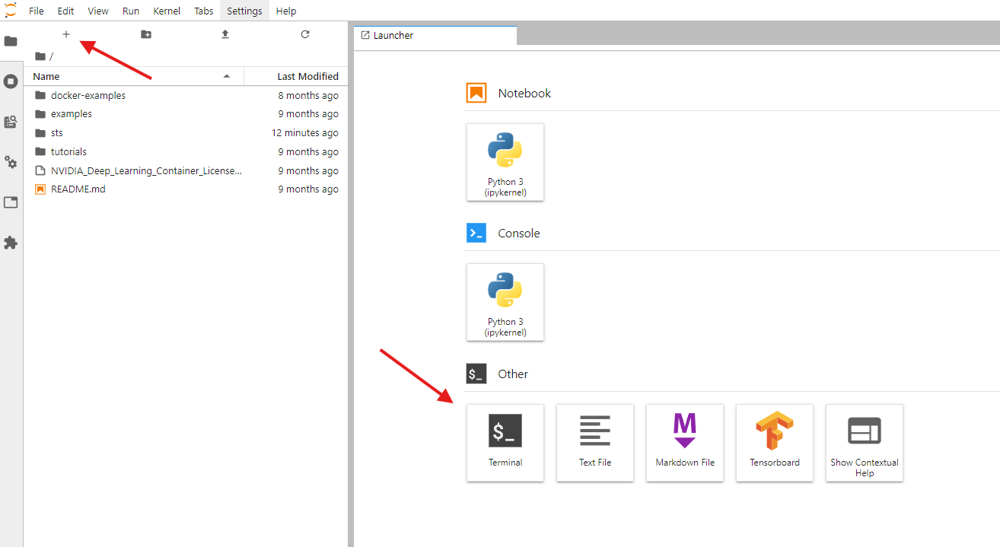
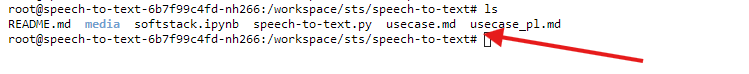
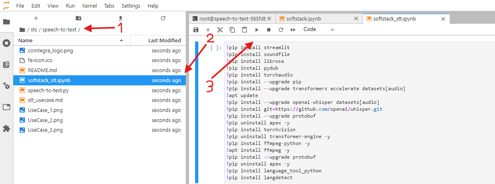
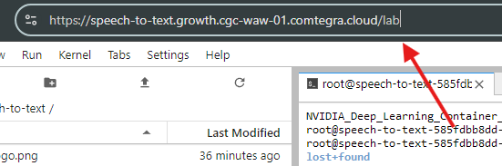
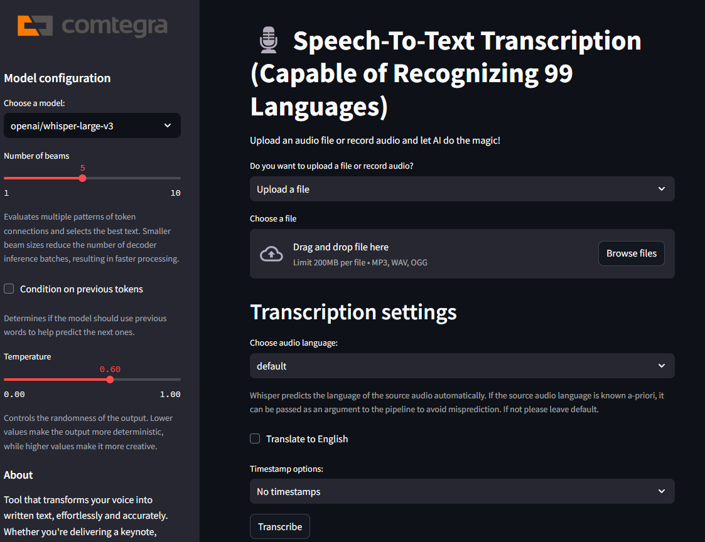
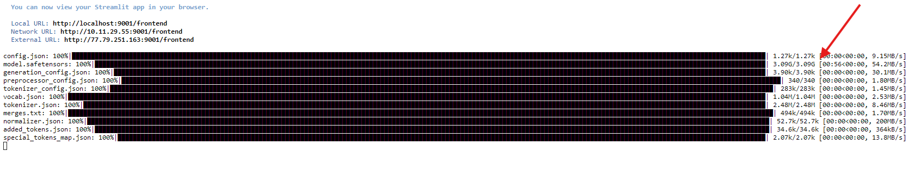
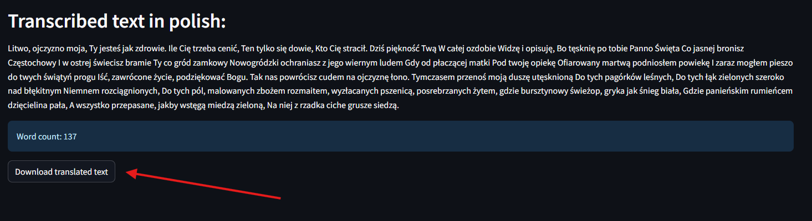
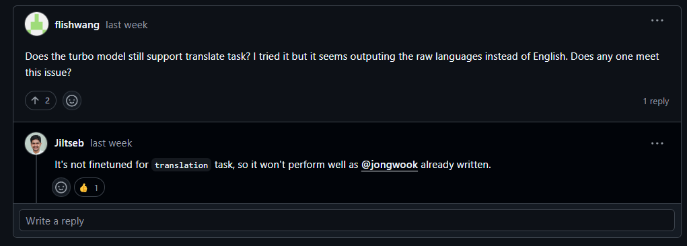

# Speech-To-Text

Speech-To-Text to narzędzie, które przekształca mowę na pisany tekst za pomocą AI.

## Jak uruchamiać

### Konfiguracja środowiska CGC

Tę aplikację można wdrożyć i uruchomić na chmurze Comtegra GPU Cloud (CGC) dla zwiększenia dostępności i skalowalności. CGC zapewnia solidne i bezpieczne środowisko zoptymalizowane pod kątem aplikacji opartych na sztucznej inteligencji, takich jak ta.

Po zainstalowaniu i skonfigurowaniu [cgcsdk](https://docs.cgc.comtegra.cloud/Getting%20Started/installation) na swoim komputerze, otwórz terminal i wykonaj następujące kroki (odpowiednie parametry można zmienić według uznania, te pokazane są domyślne i zapewniają wystarczającą moc obliczeniową do uruchomienia aplikacji):

### Tworzenie wolumenu
```bash
cgc volume create <nazwa_wolumenu> --size <rozmiar_wolumenu>
```

Na przykład, aby utworzyć wolumin o nazwie "sts" o rozmiarze 15GB, należy użyć polecenia:
```bash
cgc volume create sts --size 15
```

### Tworzenie środowiska obliczeniowego (Compute)
Na potrzeby tego projektu skonfigurujemy środowisko PyTorch przy użyciu A5000 dla optymalnej wydajności oraz 15GB woluminu.
```bash
cgc compute create --name <nazwa_środowiska> -c <ilosc_cpu> -m <ilosc_pamieci> -g <ilosc_gpu> -gt <typ_gpu> -v <nazwa_wolumenu> <obraz>
```

Na przykład, aby utworzyć środowisko obliczeniowe o nazwie "speech-to-text" i zamontować je z woluminem "sts", który utworzyliśmy wcześniej, należy użyć polecenia:
```bash
cgc compute create --name speech-to-text -c 4 -m 8 -g 1 -gt A5000 -v sts nvidia-pytorch
```

### Otwieranie portu środowiska w CGC

Po utworzeniu środowiska obliczeniowego, należy otworzyć port np. 9001, aby później uzyskać dostęp do Streamlita z poziomu przeglądarki internetowej.
```bash
cgc compute port add -n <nazwa portu> -p <numer portu> <nazwa środowiska>
```

> **Uwaga**: Możesz zmienić nazwę i numer portu na cokolwiek chcesz!

Na przykład, aby otworzyć port 9001 o nazwie "frontend" dla środowiska o nazwie "speech-to-text", należy użyć polecenia:
```bash
cgc compute port add -n frontend -p 9001 speech-to-text
```

Po wyświetleniu pytania czy chcesz wystawić port do internetu i kontynuować wpisz "Y" i naciśnij enter.

## Dostęp do CGC

Po utworzeniu środowiska obliczeniowego i otwarciu portu, musimy uzyskać dostęp do środowiska CGC za pomocą następującego polecenia w terminalu:
```bash
cgc compute list -d
```

Skopiuj link do swojego środowiska obliczeniowego z `\?token` i wklej go w przeglądarce. Możesz również uzyskać dostęp do strony logowania do środowiska CGC, po prostu kopiując link do środowiska i dopiero zalogować się podając token.

### Klonowanie repozytorium
Po zalogowaniu otwórz terminal w środowisku obliczeniowym i sklonuj repozytorium. Jeśli nie widzisz zakładki launchera, naciśnij znak plus w lewym górnym rogu i wyszukaj terminal. Następnie wpisz poniższe polecenia, aby sklonować repozytorium w katalogu, w którym chcesz je przechowywać. Użyjemy woluminu, który utworzyliśmy wcześniej.
```bash
cd sts
git clone https://github.com/Comtegra/speech-to-text.git
```


Sklonowanie repozytorium na woluminie, który utworzyliśmy wcześniej, jest korzystne, ponieważ jeśli usuniemy nasze środowisko obliczeniowe, wolumin i wszystkie pliki, które na nim umieściliśmy, nie zostaną usunięte i nie będziemy musieli ponownie klonować repozytorium.

### Instalowanie modułów

Po sklonowaniu repozytorium, przejdź do folderu, w którym sklonowałeś repozytorium, dla nas będzie to `sts/speech-to-text`. Jeśli jesteś w innym katalogu, uzyskaj dostęp do repozytorium wpisując w terminalu:
```bash
cd sts/speech-to-text
```

Aby sprawdzić, czy jesteś we właściwym folderze, użyj następującego polecenia:
```bash
ls
```

Jeśli widzisz pliki z folderu `speech-to-text`, oznacza to, że jesteś we właściwym katalogu.



Zainstaluj wymagane moduły. Użyj dostarczonego pliku Jupyter Notebook, aby zainstalować wszystkie wymagane moduły.

- **Uruchom** plik `softstack.ipynb` ze sklonowanego repozytorium, który zainstaluje wszystkie wymagane moduły.



Instalacja wszystkich modułów może potrwać kilka minut.

## Jak używać aplikacji

Po zainstalowaniu wszystkich modułów możesz uruchomić aplikację za pomocą Streamlita.

### Uruchamianie aplikacji Streamlit

1. Otwórz terminal w środowisku obliczeniowym.
2. Przejdź do folderu, w którym sklonowałeś repozytorium. W oparciu o strukturę katalogów, którą ustawiliśmy wcześniej, należy użyć następujących poleceń:
```bash
cd sts
cd speech-to-text
```
   > **Uwaga**: Jeśli podczas instalowania modułów we wcześniejszych krokach uzyskałeś dostęp do repozytorium, możesz pominąć te polecenia.

3. Uruchom aplikację Streamlit:
```bash
streamlit run speech-to-text.py --server.port <twój otwarty port> --server.baseUrlPath=/<ścieżka_do_portu>
```

> `--server.baseUrlPath=/<ścieżka_do_portu>` uwzględnia strukturę adresów URL dostarczaną przez CGC (Comtegra GPU Cloud). Ta konfiguracja zapewnia, że Streamlit poprawnie obsłuży żądania dostępne za pośrednictwem adresu URL (np. `https://nazwa-compute.namespace.region.comtegra.cloud/<ścieżka_do_portu>`).

Na przykład, aby uruchomić aplikację Streamlit na wcześniej otwartym porcie 9001 i ścieżce "frontend", należy użyć następującego polecenia:
```bash
streamlit run speech-to-text.py --server.port 9001 --server.baseUrlPath=/frontend
```

4. Otwórz przeglądarkę i przejdź do adresu URL podanego do Streamlita. (zwykle jest to `https://nazwa-compute.namespace.region.comtegra.cloud/<ścieżka_do_portu>`)

   > **Uwaga**: `/<your_base_path>` jest uwzględniony, ponieważ ustawiliśmy go jako bazową ścieżkę URL w kroku 1 za pomocą opcji `--server.baseUrlPath=/<your_base_path>`. Zastąp `<your_base_path>` dowolną ścieżką, której chcesz użyć.

Mówiąc prościej, po prostu skopiuj link do swojego środowiska obliczeniowego i zmień ostatnią część linku z `/lab` lub czegokolwiek innego, co istnieje po `.cloud` na `/frontend` lub dowolną wybraną nazwę portu.



## Jak korzystać z aplikacji

Po przekierowaniu do aplikacji, powinieneś zobaczyć następujący interfejs:



1. Kliknij przycisk "Browse files" i wybierz plik audio, którego tekst chcesz otrzymać.

2. Wybierz język pliku audio.

3. Zmień ustawienia modelu, według własnych potrzeb.
   > **Uwaga**: Zmiana ustawień może poprawić lub pogorszyć transkrypcję, w zależności od pliku audio i jego jakości.

4. Kliknij przycisk "Transcribe", aby rozpocząć transkrypcję.
   > **Uwaga**: Przycisk transkrypcji może nie pojawić się od razu po pierwszym uruchomieniu aplikacji ze względu na proces instalacji safetensorów i plików .json. Nie powinno to zająć dłużej niż ~3 minuty. 
   

5. Po zakończeniu transkrypcji, wyświetli się ona poniżej. Możesz ją pobrać za pomocą przycisku "Download translated text".


> **Uwaga**: Dane wejściowe dłuższe niż 30 sekund mogą wymagać long-form generacji, co wymaga od modelu przewidywania znaczników czasu. Jeśli model pokaże błąd, ustaw Timestamp options na "Timestamps" lub "Word-level timestamps".
   
> **Uwaga**: Whisper-large-v3-turbo nie jest finetuned do zadania tłumaczenia, więc nie będzie działał podczas tłumaczenia.



## Potencjalne problemy i ich rozwiązywanie
1. **Ważne**: Podczas pierwszego uruchomienia aplikacji może wystąpić błąd `NotImplementedError`. Jeśli tak się stanie, po prostu wyłącz aplikację streamlit, naciskając `Ctrl + C` w terminalu, w którym działa aplikacja streamlit i uruchom ją ponownie.

2. Jeśli aplikacja przestanie działać, a terminal nie reaguje na naciśnięcie `Ctrl + C`, możesz zamknąć terminal za pomocą przycisku `SHUT DOWN` po lewej stronie ekranu.

   

3. Jeśli w terminalu pojawi się informacja, że aplikacja została "Killed", po prostu uruchom ją ponownie, wpisując np. `streamlit run speech-to-text.py --server.port 9001 --server.baseUrlPath=/frontend` w terminalu.

4. Jeśli model halucynuje lub popełnia błędy w transkrypcji, zmień model i ustawienia. Spróbuj znaleźć najlepsze ustawienia dla swojego pliku audio i jego jakości.

5. Jeśli powyższy krok nie działa, sprawdź jakość swojego pliku audio. Jeśli jest zła, spróbuj znaleźć lepsze nagranie swojego dźwięku. Jeśli dźwięk jest względnie dobry, ale model nadal halucynuje, spróbuj użyć dłuższego pliku audio lub usunąć fragmenty bez mowy lub z niewyraźnym szmerem w tle.

